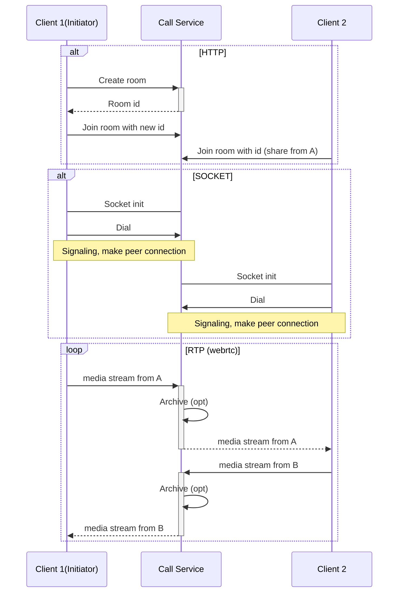

```mermaid

sequenceDiagram
    participant A as Client 1(Initiator)
    participant S as Call Service
    participant B as Client 2

    alt HTTP
        A ->>+ S: Create room 
        S -->>- A: Room id 
        A ->> S: Join room with new id
        B ->> S : Join room with id (share from A)
    end

    alt SOCKET
        S -> A: Socket init
        A ->> S: Dial
        Note over A, S: Signaling, make peer connection
        S -> B: Socket init
        B ->> S: Dial
        Note over B, S: Signaling, make peer connection
    end

    loop RTP (webrtc)
        A ->>+ S : media stream from A
        S ->> S: Archive (opt)
        S -->>- B : media stream from A
        B ->>+ S : media stream from B
        S ->> S: Archive (opt)
        S -->>- A : media stream from B
    end

```