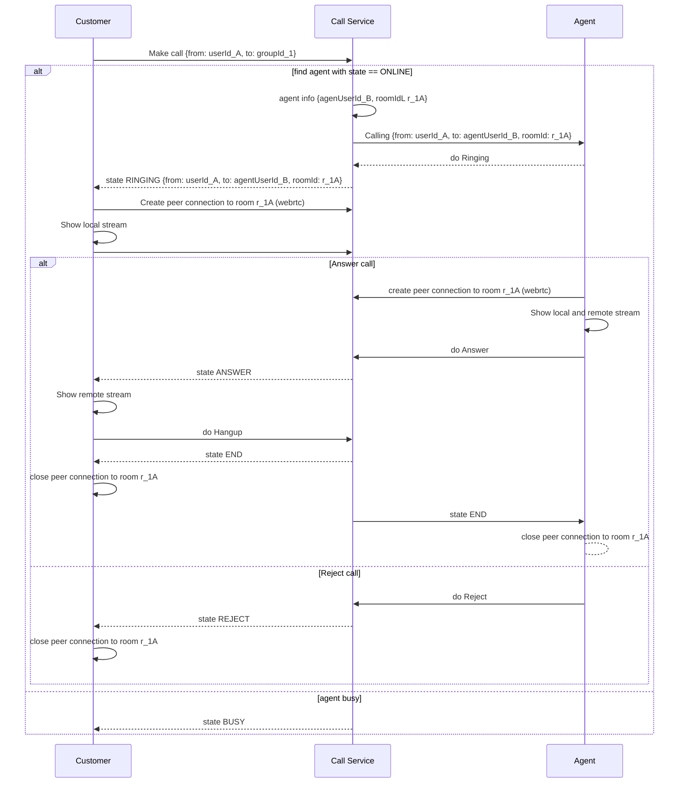

```mermaid

sequenceDiagram
    participant A as Customer
    participant S as Call Service
    participant B as Agent

    A ->> S: Make call {from: userId_A, to: groupId_1} 
    alt find agent with state == ONLINE
        S ->> S: agent info {agenUserId_B, roomIdL r_1A}
        S ->> B: Calling {from: userId_A, to: agentUserId_B, roomId: r_1A}
        B -->> S: do Ringing
        S -->> A: state RINGING {from: userId_A, to: agentUserId_B, roomId: r_1A}
        A ->> S: Create peer connection to room r_1A (webrtc)
        A ->> A: Show local stream
        A ->> S: 

            alt Answer call
                B ->> S: create peer connection to room r_1A (webrtc)
                B ->> B: Show local and remote stream
                B ->> S: do Answer

                S -->> A: state ANSWER
                A ->> A: Show remote stream
                A ->> S : do Hangup
                S -->> A: state END
                A ->> A :close peer connection to room r_1A
                S ->> B : state END
                B --> B : close peer connection to room r_1A

            else Reject call
                B ->> S : do Reject
                S -->> A : state REJECT
                A ->> A: close peer connection to room r_1A    
            end
    else agent busy
        S -->> A: state BUSY 
    end


```